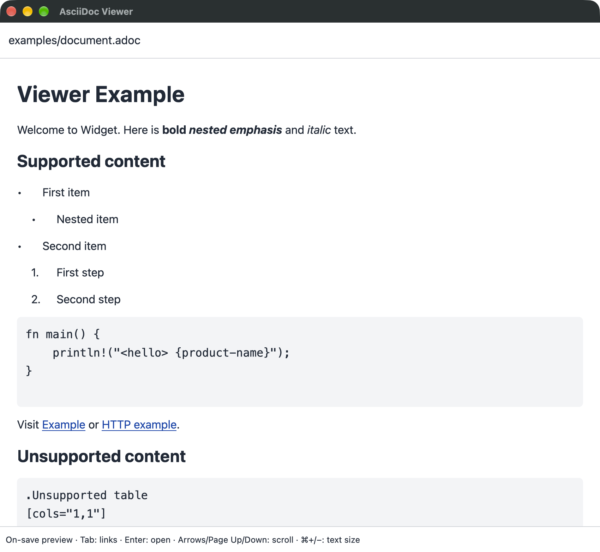

# AsciiDoc Viewer

A standalone native AsciiDoc previewer built with Rust and [GPUI](https://www.gpui.rs/). Keep it beside your editor: save the file and the preview refreshes automatically.

**Status:** macOS feasibility experiment, not a production-ready or fully Asciidoctor-compatible renderer.



## Run

You need macOS, Rust/Cargo, and Xcode developer tools with the macOS SDK. Tested on Apple Silicon with Rust 1.96.0. GPUI uses runtime Metal shaders; a separate Xcode Metal Toolchain download is not required.

```sh
git clone https://github.com/dunyakirkali/asciidoc-viewer.git
cd asciidoc-viewer
cargo run --locked -- examples/document.adoc
```

To preview your own document:

```sh
cargo run --locked -- /path/to/document.adoc
```

Pass one regular UTF-8 file, up to 8 MiB. The viewer never writes it. Saved changes are checked every 250 ms, including atomic editor saves; unsaved editor buffers are not visible to the viewer.

## What renders

- Headings and paragraphs.
- Bold, italic, and nested emphasis.
- Ordered, unordered, and nested lists.
- Plain listing/code blocks, without syntax highlighting.
- HTTP/HTTPS links that open in the system browser.
- The processor's built-in attribute substitution.

Tables, images, admonitions, includes, local-file links, cross-references, and other unsupported constructs remain raw source. Includes never expand or read external content. Formatted or HTML-escaped titles also fall back to raw source with a diagnostic.

Unrecoverable parsing shows the current source with a diagnostic. Read failures clearly identify the last readable source and keep retrying. Scrolling retains its pixel offset where practical.

## Controls

| Action | Input |
| --- | --- |
| Scroll | Mouse/trackpad, arrows, Page Up/Down, Space/Shift-Space, Home/End |
| Select a web link | Tab / Shift-Tab |
| Open the selected link | Enter |
| Clear link selection | Escape |
| Adjust text size | Cmd-plus / Cmd-minus |
| Reset text size | Cmd-0 |
| Quit | Cmd-Q or close the window |

## Checks

```sh
make tools
make check
```

This runs default rustfmt and Clippy checks, the projection test with an HTML coverage report, and a RustSec dependency audit. Tools and reports stay under ignored `target/` paths. Coverage measures the library, not the desktop window; no percentage gate is enforced. See [quality checks and known dependency warnings](docs/quality.md).

The native refresh/input-handler gate opens a temporary test window and exits automatically:

```sh
cargo run --locked --example viewer_gate
```

Actual OS input delivery, browser activation, VoiceOver, sustained responsiveness, and arbitrary-input source preservation still need broader acceptance checks. Cross-platform support, packaging, editor integration, tabs, a file picker, and full AsciiDoc rendering are out of scope for this experiment.

## Notes

- [Design, acceptance checks, and limitations](docs/design.md)
- [Processor and GPUI research](docs/research.md)
- [Glossary](GLOSSARY.md)
